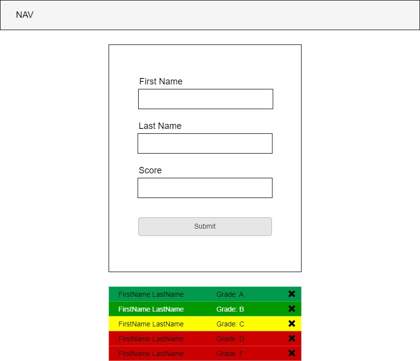

# Gradebook Assistant (Part 2)

## Assignment

Your task is to build a front-end application using HTML, CSS, and JavaScript. This application will act as a tool that a teacher could use to track and sort the grades from a classroom test. Over time, you will continuosly build upon this application by adding new features and improving old ones.

In part two, you will create a GitHub repository to implement version control on your project. You will also create a project board to track issues for this project. You will invite your instructors to the repository so that they may view your code when necessary.

Additionally, you will add a feature that allows you to leave the page and come back without losing your work. Finally, will add a delete button so that a students test score may be deleted from the list.



## User Story

```md
AS A teacher
I WANT the ability to leave the page
SO THAT I can come back later and resume my work
```

## Requirements

```md
GIVEN a front-end application that takes student test scores
WHEN I navigate away from the page
THEN my work is preserved. The students first name, last name,
and converted letter grade is displayed on the screen with the
appropriate background color, displayed in order from highest to lowest grades when I come back to the page
```

## Recommended Documentation

### Local Storage (Reading)

- [W2 Schools](https://www.w3schools.com/jsref/prop_win_localstorage.asp)
- [MDN web Docs](https://developer.mozilla.org/en-US/docs/Web/API/Window/localStorage)

### Local Storage (Video)

- [Web Dev Simplified live demo](https://www.youtube.com/watch?v=GihQAC1I39Q)
- [dcode live demo](https://www.youtube.com/watch?v=k8yJCeuP6I8&t=5s)
